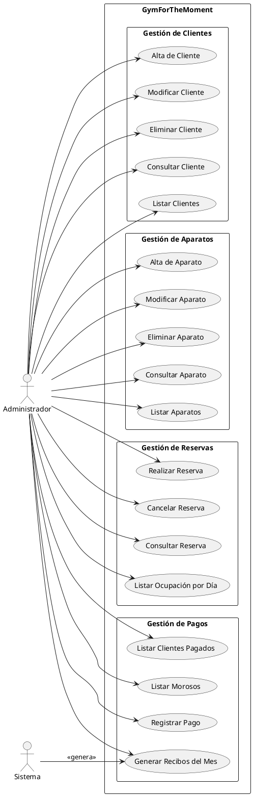

# Diagrama de Casos de Uso - GymForTheMoment

## 1. Actores

| Actor | Descripción |
|-------|-------------|
| **Administrador** | Usuario que gestiona el gimnasio. Puede realizar todas las operaciones del sistema |
| **Sistema** | Actor automático que genera recibos y realiza cálculos |

---

## 2. Diagrama de Casos de Uso (Representación Textual)

```
┌─────────────────────────────────────────────────────────────────────────────────┐
│                        SISTEMA GYMFORTHEMOMENT                                  │
│                                                                                 │
│  ┌──────────────────────────────────────────────────────────────────────────┐  │
│  │                        GESTIÓN DE CLIENTES                               │  │
│  │                                                                          │  │
│  │    ○ CU01: Alta de Cliente                                               │  │
│  │    ○ CU02: Modificar Cliente                                             │  │
│  │    ○ CU03: Eliminar Cliente                                              │  │
│  │    ○ CU04: Consultar Cliente                                             │  │
│  │    ○ CU05: Listar Clientes                                               │  │
│  │                                                                          │  │
│  └──────────────────────────────────────────────────────────────────────────┘  │
│                                                                                 │
│  ┌──────────────────────────────────────────────────────────────────────────┐  │
│  │                        GESTIÓN DE APARATOS                               │  │
│  │                                                                          │  │
│  │    ○ CU06: Alta de Aparato                                               │  │
│  │    ○ CU07: Modificar Aparato                                             │  │
│  │    ○ CU08: Eliminar Aparato                                              │  │
│  │    ○ CU09: Consultar Aparato                                             │  │
│  │    ○ CU10: Listar Aparatos                                               │  │
│  │                                                                          │  │
│  └──────────────────────────────────────────────────────────────────────────┘  │
│                                                                                 │
│  ┌──────────────────────────────────────────────────────────────────────────┐  │
│  │                        GESTIÓN DE RESERVAS                               │  │
│  │                                                                          │  │
│  │    ○ CU11: Realizar Reserva                                              │  │
│  │    ○ CU12: Cancelar Reserva                                              │  │
│  │    ○ CU13: Consultar Reserva                                             │  │
│  │    ○ CU14: Listar Ocupación por Día  ◄─── (Requisito principal)          │  │
│  │                                                                          │  │
│  └──────────────────────────────────────────────────────────────────────────┘  │
│                                                                                 │
│  ┌──────────────────────────────────────────────────────────────────────────┐  │
│  │                        GESTIÓN DE PAGOS                                  │  │
│  │                                                                          │  │
│  │    ○ CU15: Generar Recibos del Mes  ◄─── (Requisito principal)           │  │
│  │    ○ CU16: Registrar Pago                                                │  │
│  │    ○ CU17: Listar Clientes que han Pagado                                │  │
│  │    ○ CU18: Listar Clientes Morosos  ◄─── (Requisito principal)           │  │
│  │                                                                          │  │
│  └──────────────────────────────────────────────────────────────────────────┘  │
│                                                                                 │
└─────────────────────────────────────────────────────────────────────────────────┘

        │                                                          │
        │                                                          │
        ▼                                                          ▼
   ┌─────────┐                                               ┌──────────┐
   │  👤     │                                               │  ⚙️      │
   │ Admin   │                                               │ Sistema  │
   └─────────┘                                               └──────────┘
```

---

## 3. Especificación de Casos de Uso Principales

### CU11: Realizar Reserva

| Campo | Descripción |
|-------|-------------|
| **ID** | CU11 |
| **Nombre** | Realizar Reserva |
| **Actor Principal** | Administrador |
| **Descripción** | Permite reservar una sesión de 30 minutos en un aparato para un cliente |
| **Precondiciones** | - El cliente debe existir en el sistema<br>- El aparato debe existir en el sistema |
| **Flujo Principal** | 1. El administrador selecciona la opción "Realizar Reserva"<br>2. El sistema muestra formulario de reserva<br>3. El administrador selecciona cliente, aparato, día y hora<br>4. El sistema verifica disponibilidad<br>5. El sistema registra la reserva<br>6. El sistema muestra confirmación |
| **Flujo Alternativo** | 4a. Si el horario está ocupado:<br>   - El sistema muestra mensaje de error<br>   - Vuelve al paso 3 |
| **Postcondiciones** | La reserva queda registrada en el sistema |

---

### CU14: Listar Ocupación por Día

| Campo | Descripción |
|-------|-------------|
| **ID** | CU14 |
| **Nombre** | Listar Ocupación por Día |
| **Actor Principal** | Administrador |
| **Descripción** | Genera un listado de las horas ocupadas de cada aparato para un día específico |
| **Precondiciones** | Ninguna |
| **Flujo Principal** | 1. El administrador selecciona "Listar Ocupación"<br>2. El sistema solicita el día de la semana<br>3. El administrador selecciona un día (lunes a viernes)<br>4. El sistema genera el listado con todos los aparatos<br>5. Para cada aparato muestra las 48 franjas de 30 min<br>6. Indica si está libre u ocupado y por qué cliente |
| **Postcondiciones** | Se muestra el listado en pantalla |

---

### CU15: Generar Recibos del Mes

| Campo | Descripción |
|-------|-------------|
| **ID** | CU15 |
| **Nombre** | Generar Recibos del Mes |
| **Actor Principal** | Administrador / Sistema |
| **Descripción** | Genera los recibos mensuales para todos los clientes activos |
| **Precondiciones** | - Deben existir clientes en el sistema<br>- No deben existir recibos para ese mes |
| **Flujo Principal** | 1. El administrador selecciona "Generar Recibos"<br>2. El sistema solicita mes y año<br>3. El administrador introduce los datos<br>4. El sistema genera un recibo para cada cliente activo<br>5. El sistema muestra resumen de recibos generados |
| **Flujo Alternativo** | 4a. Si ya existen recibos para ese mes:<br>   - El sistema pregunta si desea regenerarlos<br>   - Si confirma, elimina los existentes y genera nuevos |
| **Postcondiciones** | Los recibos quedan registrados como "pendientes" |

---

### CU16: Registrar Pago

| Campo | Descripción |
|-------|-------------|
| **ID** | CU16 |
| **Nombre** | Registrar Pago |
| **Actor Principal** | Administrador |
| **Descripción** | Marca un recibo como pagado |
| **Precondiciones** | - Debe existir el recibo<br>- El recibo debe estar pendiente |
| **Flujo Principal** | 1. El administrador selecciona "Registrar Pago"<br>2. El sistema muestra recibos pendientes<br>3. El administrador selecciona el recibo<br>4. El sistema registra el pago con fecha actual<br>5. El sistema muestra confirmación |
| **Postcondiciones** | El recibo queda marcado como pagado |

---

### CU18: Listar Clientes Morosos

| Campo | Descripción |
|-------|-------------|
| **ID** | CU18 |
| **Nombre** | Listar Clientes Morosos |
| **Actor Principal** | Administrador |
| **Descripción** | Muestra un listado de clientes con recibos pendientes de pago |
| **Precondiciones** | Ninguna |
| **Flujo Principal** | 1. El administrador selecciona "Listar Morosos"<br>2. El sistema busca clientes con recibos impagados<br>3. El sistema genera listado con:<br>   - Nombre del cliente<br>   - Número de recibos pendientes<br>   - Importe total adeudado<br>4. El sistema muestra el listado |
| **Postcondiciones** | Se muestra el listado en pantalla |

---

## 4. Diagrama de Casos de Uso (PlantUML)



---

## 5. Relaciones entre Casos de Uso

| Caso de Uso Base | Relación | Caso de Uso Relacionado |
|------------------|----------|-------------------------|
| CU11: Realizar Reserva | <<include>> | Verificar Disponibilidad |
| CU11: Realizar Reserva | <<include>> | Validar Cliente |
| CU15: Generar Recibos | <<include>> | Obtener Clientes Activos |
| CU18: Listar Morosos | <<include>> | Obtener Recibos Pendientes |
