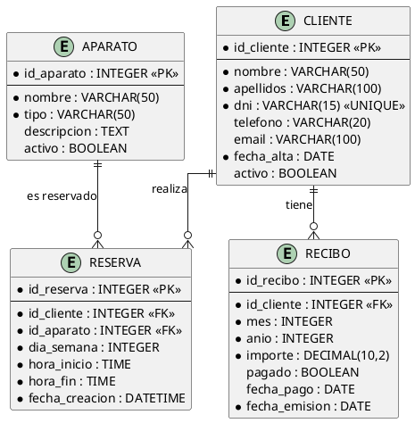

# Diagrama Entidad-Relación y Modelo Normalizado - GymForTheMoment

## 1. Diagrama Entidad-Relación (E-R)

### 1.1 Representación Textual del Diagrama E-R

```
┌─────────────────────────────────────────────────────────────────────────────────────┐
│                              DIAGRAMA E-R                                           │
└─────────────────────────────────────────────────────────────────────────────────────┘

    ┌─────────────────────┐                         ┌─────────────────────┐
    │      CLIENTE        │                         │      APARATO        │
    ├─────────────────────┤                         ├─────────────────────┤
    │ (PK) id_cliente     │                         │ (PK) id_aparato     │
    │ nombre              │                         │ nombre              │
    │ apellidos           │                         │ tipo                │
    │ dni                 │                         │ descripcion         │
    │ telefono            │                         │ activo              │
    │ email               │                         └──────────┬──────────┘
    │ fecha_alta          │                                    │
    │ activo              │                                    │
    └──────────┬──────────┘                                    │
               │                                               │
               │                                               │
               │ 1                                           1 │
               │                                               │
               ▼                                               ▼
               ○──────────────────────────────────────────────○
               │                  RESERVA                      │
               │                                               │
               │  (PK) id_reserva                              │
               │  (FK) id_cliente ─────────────────────────────┤
               │  (FK) id_aparato ─────────────────────────────┤
               │  dia_semana                                   │
               │  hora_inicio                                  │
               │  hora_fin                                     │
               │  fecha_creacion                               │
               ○───────────────────────────────────────────────○
                              N                    N
               
               
    ┌─────────────────────┐
    │      CLIENTE        │
    ├─────────────────────┤
    │ (PK) id_cliente     │
    └──────────┬──────────┘
               │
               │ 1
               │
               ▼
    ┌─────────────────────┐
    │      RECIBO         │
    ├─────────────────────┤
    │ (PK) id_recibo      │
    │ (FK) id_cliente     │
    │ mes                 │
    │ anio                │
    │ importe             │
    │ pagado              │
    │ fecha_pago          │
    │ fecha_emision       │
    └─────────────────────┘
               N
```

### 1.2 Entidades y Atributos

#### CLIENTE
| Atributo | Tipo | Descripción | Restricciones |
|----------|------|-------------|---------------|
| **id_cliente** | INTEGER | Identificador único (PK) | NOT NULL, AUTO_INCREMENT |
| nombre | VARCHAR(50) | Nombre del cliente | NOT NULL |
| apellidos | VARCHAR(100) | Apellidos del cliente | NOT NULL |
| dni | VARCHAR(15) | Documento de identidad | NOT NULL, UNIQUE |
| telefono | VARCHAR(20) | Teléfono de contacto | |
| email | VARCHAR(100) | Correo electrónico | |
| fecha_alta | DATE | Fecha de registro | NOT NULL |
| activo | BOOLEAN | Estado del cliente | DEFAULT TRUE |

#### APARATO
| Atributo | Tipo | Descripción | Restricciones |
|----------|------|-------------|---------------|
| **id_aparato** | INTEGER | Identificador único (PK) | NOT NULL, AUTO_INCREMENT |
| nombre | VARCHAR(50) | Nombre del aparato | NOT NULL |
| tipo | VARCHAR(50) | Tipo de aparato | NOT NULL |
| descripcion | TEXT | Descripción detallada | |
| activo | BOOLEAN | Estado del aparato | DEFAULT TRUE |

#### RESERVA
| Atributo | Tipo | Descripción | Restricciones |
|----------|------|-------------|---------------|
| **id_reserva** | INTEGER | Identificador único (PK) | NOT NULL, AUTO_INCREMENT |
| id_cliente | INTEGER | FK a Cliente | NOT NULL |
| id_aparato | INTEGER | FK a Aparato | NOT NULL |
| dia_semana | INTEGER | Día (1=Lunes, 5=Viernes) | NOT NULL, CHECK (1-5) |
| hora_inicio | TIME | Hora de inicio | NOT NULL |
| hora_fin | TIME | Hora de fin | NOT NULL |
| fecha_creacion | DATETIME | Fecha de la reserva | NOT NULL |

#### RECIBO
| Atributo | Tipo | Descripción | Restricciones |
|----------|------|-------------|---------------|
| **id_recibo** | INTEGER | Identificador único (PK) | NOT NULL, AUTO_INCREMENT |
| id_cliente | INTEGER | FK a Cliente | NOT NULL |
| mes | INTEGER | Mes del recibo | NOT NULL, CHECK (1-12) |
| anio | INTEGER | Año del recibo | NOT NULL |
| importe | DECIMAL(10,2) | Cantidad a pagar | NOT NULL |
| pagado | BOOLEAN | Estado de pago | DEFAULT FALSE |
| fecha_pago | DATE | Fecha en que se pagó | |
| fecha_emision | DATE | Fecha de emisión | NOT NULL |

---

## 2. Relaciones

| Relación | Entidad 1 | Cardinalidad | Entidad 2 | Descripción |
|----------|-----------|--------------|-----------|-------------|
| **tiene** | CLIENTE | 1:N | RESERVA | Un cliente puede tener muchas reservas |
| **usa** | APARATO | 1:N | RESERVA | Un aparato puede tener muchas reservas |
| **genera** | CLIENTE | 1:N | RECIBO | Un cliente puede tener muchos recibos |

---

## 3. Diagrama E-R (PlantUML)



---

## 4. Modelo Normalizado

### 4.1 Primera Forma Normal (1FN) ✓
- Todas las tablas tienen una clave primaria definida
- No hay grupos repetitivos
- Todos los atributos son atómicos (no hay atributos multivaluados)

### 4.2 Segunda Forma Normal (2FN) ✓
- Cumple 1FN
- Todos los atributos no clave dependen completamente de la clave primaria
- No hay dependencias parciales

### 4.3 Tercera Forma Normal (3FN) ✓
- Cumple 2FN
- No hay dependencias transitivas
- Todos los atributos no clave dependen únicamente de la clave primaria

---

## 5. Script SQL de Creación

```sql
-- =====================================================
-- SCRIPT DE CREACIÓN DE BASE DE DATOS - GYMFORTHEMOMENT
-- =====================================================

-- Crear tabla CLIENTE
CREATE TABLE IF NOT EXISTS cliente (
    id_cliente INTEGER PRIMARY KEY AUTOINCREMENT,
    nombre VARCHAR(50) NOT NULL,
    apellidos VARCHAR(100) NOT NULL,
    dni VARCHAR(15) NOT NULL UNIQUE,
    telefono VARCHAR(20),
    email VARCHAR(100),
    fecha_alta DATE NOT NULL,
    activo BOOLEAN DEFAULT 1
);

-- Crear tabla APARATO
CREATE TABLE IF NOT EXISTS aparato (
    id_aparato INTEGER PRIMARY KEY AUTOINCREMENT,
    nombre VARCHAR(50) NOT NULL,
    tipo VARCHAR(50) NOT NULL,
    descripcion TEXT,
    activo BOOLEAN DEFAULT 1
);

-- Crear tabla RESERVA
CREATE TABLE IF NOT EXISTS reserva (
    id_reserva INTEGER PRIMARY KEY AUTOINCREMENT,
    id_cliente INTEGER NOT NULL,
    id_aparato INTEGER NOT NULL,
    dia_semana INTEGER NOT NULL CHECK (dia_semana BETWEEN 1 AND 5),
    hora_inicio TIME NOT NULL,
    hora_fin TIME NOT NULL,
    fecha_creacion DATETIME NOT NULL DEFAULT CURRENT_TIMESTAMP,
    FOREIGN KEY (id_cliente) REFERENCES cliente(id_cliente) ON DELETE CASCADE,
    FOREIGN KEY (id_aparato) REFERENCES aparato(id_aparato) ON DELETE CASCADE,
    UNIQUE (id_aparato, dia_semana, hora_inicio)
);

-- Crear tabla RECIBO
CREATE TABLE IF NOT EXISTS recibo (
    id_recibo INTEGER PRIMARY KEY AUTOINCREMENT,
    id_cliente INTEGER NOT NULL,
    mes INTEGER NOT NULL CHECK (mes BETWEEN 1 AND 12),
    anio INTEGER NOT NULL,
    importe DECIMAL(10,2) NOT NULL,
    pagado BOOLEAN DEFAULT 0,
    fecha_pago DATE,
    fecha_emision DATE NOT NULL DEFAULT CURRENT_DATE,
    FOREIGN KEY (id_cliente) REFERENCES cliente(id_cliente) ON DELETE CASCADE,
    UNIQUE (id_cliente, mes, anio)
);

-- Índices para optimización
CREATE INDEX idx_reserva_dia ON reserva(dia_semana);
CREATE INDEX idx_reserva_aparato ON reserva(id_aparato);
CREATE INDEX idx_recibo_pagado ON recibo(pagado);
CREATE INDEX idx_recibo_cliente ON recibo(id_cliente);
```

---

## 6. Diccionario de Datos

### Tabla: CLIENTE
| Campo | Tipo | Nulo | Clave | Default | Descripción |
|-------|------|------|-------|---------|-------------|
| id_cliente | INTEGER | NO | PK | AUTO | ID único del cliente |
| nombre | VARCHAR(50) | NO | | | Nombre del cliente |
| apellidos | VARCHAR(100) | NO | | | Apellidos del cliente |
| dni | VARCHAR(15) | NO | UK | | DNI/NIE del cliente |
| telefono | VARCHAR(20) | SI | | NULL | Teléfono de contacto |
| email | VARCHAR(100) | SI | | NULL | Email del cliente |
| fecha_alta | DATE | NO | | | Fecha de alta en el gimnasio |
| activo | BOOLEAN | NO | | TRUE | Si el cliente está activo |

### Tabla: APARATO
| Campo | Tipo | Nulo | Clave | Default | Descripción |
|-------|------|------|-------|---------|-------------|
| id_aparato | INTEGER | NO | PK | AUTO | ID único del aparato |
| nombre | VARCHAR(50) | NO | | | Nombre del aparato |
| tipo | VARCHAR(50) | NO | | | Categoría del aparato |
| descripcion | TEXT | SI | | NULL | Descripción detallada |
| activo | BOOLEAN | NO | | TRUE | Si el aparato está activo |

### Tabla: RESERVA
| Campo | Tipo | Nulo | Clave | Default | Descripción |
|-------|------|------|-------|---------|-------------|
| id_reserva | INTEGER | NO | PK | AUTO | ID único de la reserva |
| id_cliente | INTEGER | NO | FK | | Referencia al cliente |
| id_aparato | INTEGER | NO | FK | | Referencia al aparato |
| dia_semana | INTEGER | NO | | | Día (1=Lun, 2=Mar, 3=Mié, 4=Jue, 5=Vie) |
| hora_inicio | TIME | NO | | | Hora de inicio de la sesión |
| hora_fin | TIME | NO | | | Hora de fin de la sesión |
| fecha_creacion | DATETIME | NO | | NOW | Fecha de creación de la reserva |

### Tabla: RECIBO
| Campo | Tipo | Nulo | Clave | Default | Descripción |
|-------|------|------|-------|---------|-------------|
| id_recibo | INTEGER | NO | PK | AUTO | ID único del recibo |
| id_cliente | INTEGER | NO | FK | | Referencia al cliente |
| mes | INTEGER | NO | | | Mes del recibo (1-12) |
| anio | INTEGER | NO | | | Año del recibo |
| importe | DECIMAL | NO | | | Importe de la mensualidad |
| pagado | BOOLEAN | NO | | FALSE | Si está pagado |
| fecha_pago | DATE | SI | | NULL | Fecha de pago |
| fecha_emision | DATE | NO | | TODAY | Fecha de emisión |

---

## 7. Restricciones de Integridad

### Restricciones de Dominio
- `dia_semana` debe estar entre 1 y 5 (lunes a viernes)
- `mes` debe estar entre 1 y 12
- `hora_fin` debe ser exactamente 30 minutos después de `hora_inicio`

### Restricciones de Entidad
- Todas las claves primarias son únicas y no nulas
- DNI del cliente es único

### Restricciones Referenciales
- `reserva.id_cliente` referencia a `cliente.id_cliente`
- `reserva.id_aparato` referencia a `aparato.id_aparato`
- `recibo.id_cliente` referencia a `cliente.id_cliente`

### Restricciones de Negocio
- No pueden existir dos reservas para el mismo aparato, día y hora
- No pueden existir dos recibos para el mismo cliente, mes y año
